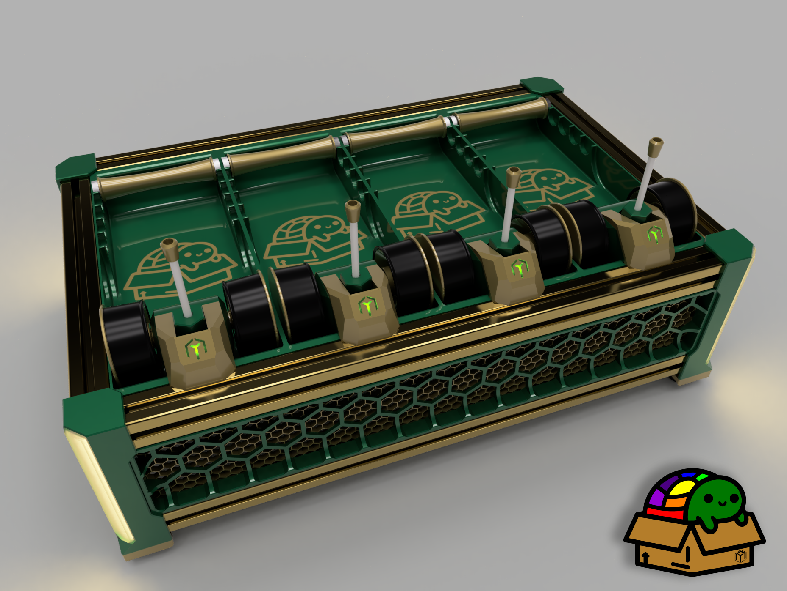

# BoxTurtle V1.0

BoxTurtle Automated Filament Control (requires AFC-Klipper-Add-On (Beta))

BoxTurtle is exactly what it appears to be — an open source AMS style filament changer
for [Klipper](https://klipper3d.org) machines.
BoxTurtle requires the AFC-Klipper Add-On (found [here](https://github.com/ArmoredTurtle/AFC-Klipper-Add-On)).
The goal of BoxTurtle is to deliver a user experience as close to an AMS as possible in vanilla Klipper. i.e. an "AMS"
for any klipperized printer regardless of form factor but [VORON Design](https://vorondesign.com) printers in
particular.

If you appreciate the work we are doing, you can support
us [here](https://www.paypal.com/donate/?hosted_button_id=J4WRJBYGFYHLE).

# How it works

BoxTurtle is a lane based automated filament changing system. Each lane is equipped with its own dedicated extruder that
moves filament to and from the tool head independently. Spool management is done with low drag, top fed electric
respoolers.

Each lane merges to a hub (combiner) with a sensor with one outlet that goes to the toolhead.

To accommodate any differences in rotation distance between the extruder in the tool head and the lane motors, BoxTurtle
uses a toolhead buffer, like [TurtleNeck](https://github.com/ArmoredTurtle/TurtleNeck) by ArmoredTurtle.

For best results we recommend the AFC-Lite, developed by [Isik's Tech @xbst](https://github.com/xbst/AFC-Lite/) as it
has the necessary sensor ports and DC brushed motor drivers used for BoxTurtle's electric respoolers.

# For best results

## AFC Klipper Add-On

BoxTurtle was designed in tandem to work with
the [AFC Klipper Add-On](https://github.com/ArmoredTurtle/AFC-Klipper-Add-On). For information on installing and
configuring the AFC Klipper Add-On, please visit [this section](../installation/getting-started.md). Most common
configuration options are prompted for during the installation process. Some of the options presented are covered below
at a high level.

The AFC Klipper Add-On requires root access to your SBC running klipper and the ability to install/modify the
installation. Additionally, the minimum version for Klipper/Kalico is 0.12.0 and the minimum version for the klippy-env
Python installation is > 3.8.

## Filament cutter or tip forming?

BoxTurtle works most reliably with a toolhead filament cutter. Our recommended toolhead cutter solution
is [FilamATrix](https://github.com/thunderkeys/FilamATrix). Please visit that GitHub repository for the most up-to-date
instructions and information. Ensure that toolhead cutting is selected during installing the AFC Klipper Add-On, or
enable it manually by editing `AFC/AFC.cfg` and restarting Klipper.

If a toolhead filament cutter is not a possibility, tip forming is also an option. This is enabled via the installation
script or by editing `AFC/AFC.cfg` and restarting Klipper. Tip forming is extremely dependent on your printer,
filament and even environment and guidance on properly tuning this is outside the scope of this document. Please visit
the [ArmoredTurtle Discord](https://discord.gg/eT8zc3bvPR) for community support on tip forming.

## Filament sensor

A pre-extruder toolhead filament sensor is recommended but not required if using
a [TurtleNeck](https://github.com/ArmoredTurtle/TurtleNeck)
or [TurtleNeck 2](https://github.com/ArmoredTurtle/TurtleNeck2.0) filament buffer. A post-extruder filament sensor can
be defined in the AFC configurations, but is not currently used beyond reporting status of the sensor.

Options include:

- [FilamATrix](https://github.com/thunderkeys/FilamATrix)
- [Filatector](https://github.com/ArmoredTurtle/Filatector)
- [AFC Buffer Ram Sensor using TurtleNeck](../installation/buffer-ram-sensor.md)

## Waste management

### Pooping, Kicking, and Wiping?

One option for filament purge/waste can be to have the printer 'poop' blobs of filament on the bed, have the nozzle
cleaned with a brush/wipe, and then return the toolhead near the blob and kick off the bed using kinematics into a
bucket or other waste evacuation system. This works similar to the method used
by [Blobifier](https://github.com/Dendrowen/Blobifier), but does not require servo actuation. Enabling poop/kick/wipe
macros can result in more reliable filament changes and color separation, at the cost of additional time during each
filament swap. Each option can be enabled or disabled during the AFC installation process, or by editing `AFC/AFC.cfg`
and restarting Klipper.

### Prime towers

Filament prime towers can be used standalone, or in combination with the above to minimize the chance that no blobs or
oozes from the filament change process make it on to your final print. However, if you are using pooping as described
above, you likely need far less purging than the default slicer settings suggest. You can adjust the 'flushing volumes'
in most slicers, as well as the size of your prime/purge tower. A decent starting setting for these might be a flushing
volume multiplier of 0.1-0.2 and a tower width size of 20mm.

If you want to rely solely on the poop purge, a static size wipe tower can be set by disabling the 'Purge into Prime
Tower' setting in your slicer software's "Printer Settings".

Different filament color transitions will require different purge volumes, and thus tuning this is highly dependent on
your filaments and prints you are performing.

# Enclosure

The enclosure option for BoxTurtle has been moved to
its [own repository](https://github.com/ArmoredTurtle/BoxTurtle-Enclosure). The enclosure is
still [under development](https://www.youtube.com/watch?v=Jjgi8q28Y2o), but the most up-to-date information on it can be
found at that repository. Also considering [joining the ArmoredTurtle Discord](https://discord.gg/eT8zc3bvPR) to get
progress updates as development progresses.

# Errata

Identified known issues and potential workarounds are documented in the [errata section](./errata.md).

# Manual

ArmoredTurtle's project manuals are hosted [here](https://armoredturtle.xyz). There is no PDF, this is intended to make
the build experience as easy as possible.
[BoxTurtle Assembly Manual](https://armoredturtle.xyz/manual-sections.html?manual=boxturtle)

# Printed Parts

!!!warning

    This is NOT a [VORON Design](https://vorondesign.com) project, we strongly recommend that you run a
    profile that is specific to BoxTurtle. Voron parts profiles are not recommended for BoxTurtle printed parts, as the
    tolerance expectations are different.

Specifically, make sure you are tuning for skew and filament shrinkage. An excellent tool for this is
Vector3D's [Califlower Mk2](https://vector3d.shop/products/califlower-calibration-tool-mk2) (yes, it's worth the $14).
Do this *before* you print 1.5-2kg worth of filament for BoxTurtle parts!

If you purchased a kit, all the parts you need to print are located in
the [Base_Build](https://github.com/ArmoredTurtle/BoxTurtle/tree/main/STLs/Base_Build) folder under STLs on this
repository. There is also a [web-based configurator](https://armoredturtle.xyz/stl-configurator.html) available for easy
identification and download of what STLs to print outside a base kit build.

All parts are pre-oriented for printing and have all required support pre-built into the STLs. OrcaSlicer/BambuStudio (
and possible others) may give warnings about certain parts having 'floating cantilevers', these are breakaway support
structures and these errors can safely be ignored.

If you have an LDO BoxTurtle kit, these are the options to pick on the web-based configurator:

- `Would you like normal or monolithic skirts?` - your choice. If you can fit monolithic on your printer, it has a
  more unified look vs the split parts. We recommend a 350mm minimum size bed for this, but you may be able to get them
  to squeak in on a ~300-305mm plate.
- `Would you prefer a hub or pass through skirts?` - Hub is our recommended default choice.
- `Are you using printed corners or extrusion corners?` - Printed corners
- `LED corners or plain?` - Plain
- `Are you using D2F or D2HW style switches?` - D2HW
- `Would you like to print the Hardware or No-Hardware version of the trays?` - Choose No Hardware if you have a
  minimum 235x235mm bed. Some Ender-style printers have a maximum 220x220mm printable volume, and so the 'bars' that
  slot into the extrusion require hardware (heat sets/screws) to attach to the tray.
- `What style tray would you like to print? Plain, Inlay, Multicolor, or Desiccant?` - Again, a bit of personal
  choice. Plain would be the base option, but there's no reason you couldn't print the others. An enclosure
  is [in the works](https://www.youtube.com/watch?v=Jjgi8q28Y2o) so if you wanted to future-proof for that, desiccant
  trays are available (in two sizes).
- `Would you like to print a TurtleNeck buffer?` - Yes

If all of the above sounds a bit overwhelming, you can print all the parts
in [LDO_BoxTurtle_Kit_STLs.zip,](https://github.com/ArmoredTurtle/BoxTurtle/tree/main/STLs/STLs/LDO_BoxTurtle_Kit_STLs.zip)
and they will be the right ones to build a functioning BoxTurtle.

For the 'No Hardware' trays, you may wish to enable 'Thick bridges' or use a 0.25mm first layer height, as otherwise the
built-in supports may generate 0.4mm gap between the support and the printed part. The N20 motor mounts may also benefit
from an 0.25mm first layer height.

There is a calibration print that you may like to print before getting
started [here](https://www.printables.com/model/1004303-box-turtle-calibration-fidget).

# How to create a meshed look on the skirts

There are a few ways to create a 'meshed' look on the hexes on the skirts, using your slicer.

- On the print settings profile, set top and bottom layers to 0. Adjust infill pattern, density and angle to suit your
  preference.
- You can also do a height range modifier on the part from 0-3.6mm to set top/bottom layers to 0, and infill pattern,
  density and angle to suit your preference.
- If you would like a different color for the hexes, you can do a color swap at layer 19 (3.8mm with 0.2mm layer
  heights).
- [SteveBuilds](https://youtube.com/@SteveBuilds) created a custom set of skirt options with modeled in hexes and
  multi-body parts, these can be
  found [here (multi-body)](https://github.com/ArmoredTurtle/BoxTurtle/tree/main/STLs/Option_Parts/Skirts/Multibody/)
  and [here (modeled hex meshes)](https://github.com/ArmoredTurtle/BoxTurtle/tree/main/STLs/Option_Parts/Skirts/Hex_Mesh/).
  To get a two-tone color look, perform a color change at 3.2mm (layer 16 at 0.2mm print heights).

# Wiring

Refer to [wiring guide](./wiring-guide.md) for recommended wire lengths for each lane.

# PTFE sizes/lengths

!!! note
      PTFE lengths between extruder to hub are suggested starting lengths - you may need to trim a little bit off in
      order for it to have a smooth bend. The filament path should be a smooth curve without tight corners.

| Component                     | Outer Diameter | Inner Diameter | Length          | Notes                                                                   |
|-------------------------------|----------------|----------------|-----------------|-------------------------------------------------------------------------|
| Feeders to Trigger            | 4mm            | 3mm            | 50mm            | Quantity 4 ; use PTFE cutter jig                                        |
| Trigger to Extruder           | 4mm            | 3mm            | 80mm            | Quantity 4 ; use PTFE cutter jig                                        |
| Extruder to Hub (Outer lanes) | 4mm            | 2mm            | 171mm           | Quantity 2; 3mm ID will blow out. A chamfer is recommended on each end. |
| Extruder to Hub (Inner lanes) | 4mm            | 2mm            | 101mm           | Quantity 2; 3mm ID will blow out. A chamfer is recommended on each end. |
| Hub to Turtleneck             | 4mm            | 2mm            | build dependent | A chamfer is recommended on each end.                                   |
| Turtleneck to toolhead        | 4mm            | 2-3mm          | build dependent | Existing bowden tube is fine, but tighter ID can also be used.          |

# Initial startup guide

Please refer to the [Initial Startup Guide](./initial_startup/01-overview.md) after completing the 
assembly of your 
BoxTurtle for next
steps.

# Optional Accessories

Some optional printed accessories for your BoxTurtle build can be found on
the [AFC-Accessories](https://github.com/ArmoredTurtle/AFC-Accessories) repository.

# BoxTurtle sourcing/vendors

While BoxTurtle can be mostly self-sourced, some vendors offer partial or full BoxTurtle kits. These vendors also have
dedicated channels on the Armored Turtle Discord.

If you purchase a kit from a vendor not on this list, it has not been validated in any way by the ArmoredTurtle team for
either quality or completeness. For best results we recommend using a trusted vendor from the list below whenever
possible. If you are a vendor and would like to be added to this list, please open a ticket on our Discord to request
being added.

US:

- [DLLPDF](https://dllpdf.com) sells a [BoxTurtle frame kit](http://dllpdf.com/box-turtle-frame)
- [Isik's Tech](https://store.isiks.tech/) has BOM parts, including full
  kits [here](https://store.isiks.tech/collections/box-turtle-parts). Isik's Tech also ships internationally.
- [Fabreeko](https://www.fabreeko.com/products/box-turtle?_pos=4&_psq=box&_ss=e&_v=1.0)
- [KB3D](https://kb-3d.com/store/boxturtle/2132-pre-order-ldo-box-turtle-automated-filament-changer-kit-v10.html)
- [West3D](https://west3d.com/products/box-turtle-automated-filament-changer-multi-material-unit-by-armored-turtle)

CA:

- [Sparta3D](https://sparta3d.ca/products/ldo-box-turtle-kit)

EU:

- [Alchemy3D.de](https://alchemy3d.de) has a [BOM in a box kit](https://alchemy3d.de/products/boxturtle)
- [Lab4450.com](https://lab4450.com) resells the [AFC-Lite MCU](https://lab4450.com/product/afc-lite-board/)
- [3DO](https://3do.dk/3d-printer/2946-ldo-boxturtle-afc-kit-til-klipper-printere-forudbestilling.html)

UK:

- [OneTwo3D.co.uk](https://www.onetwo3d.co.uk)
- [Desktop Machine Shop](https://www.desktopmachineshop.com/shop/ldo-boxturtle-afc-kit-v1-0-163?category=4#attribute_values=)
- [Viperworx](https://www.viperworx.uk/product/box-turtle-enclosure-panels-by-armored-turtle)

AU:

- [DREMC](https://store.dremc.com.au/products/ldo-box-turtle-hardware-kit)

# Merch

- BoxTurtle T-Shirt (sweatshirt/hoodie variants also available) ($3 from each sale goes to support ArmoredTurtle)
  via [Cotton Bureau](https://cottonbureau.com/p/QKF5XC/shirt/colored-box-turtle#/26921844/tee-men-premium-lightweight-vintage-black-tri-blend-s)

- BoxTurtle Sticker via [Dr. Mursey](https://drmursey.myshopify.com/products/box-turtle)