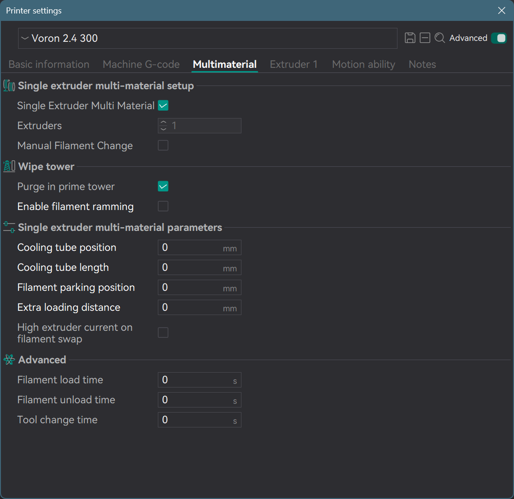
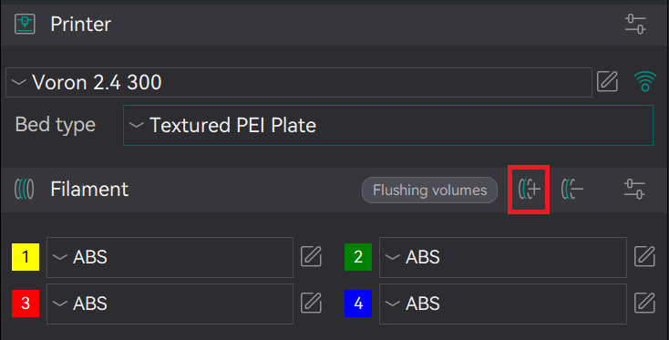
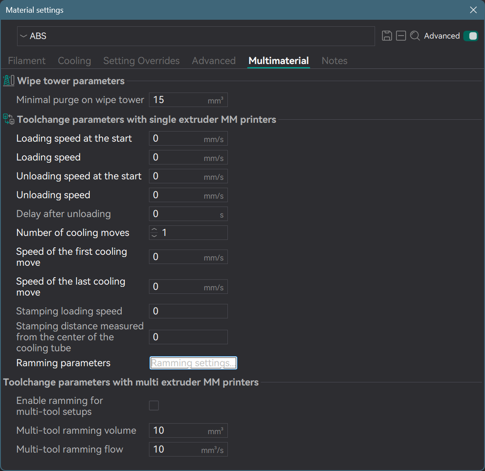
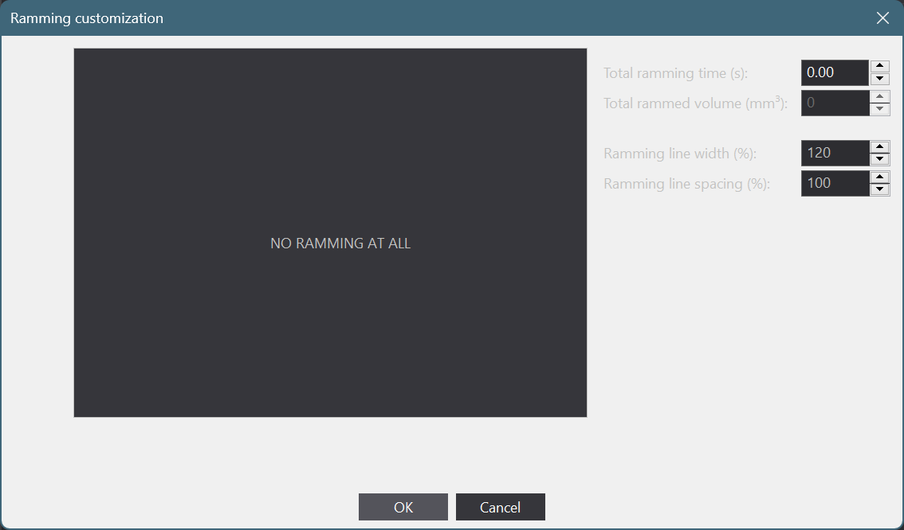

# BoxTurtle Initial Startup & Commissioning Guide

The following guide will help you on the journey to multicolor printing after you have physically completed
the [assembly of your BoxTurtle](https://armoredturtle.xyz).

## Prerequisites

### Calibrate/tune existing printer extruder

If you are installing this on a new printer or extruder (
including [FilamATrix](https://github.com/thunderkeys/FilamATrix)) ensure you have calibrated your printer/extruder
before introducing AFC/multicolor printing. If your extruder rotation distance is off by a large factor, this will cause
issues with defining values such as `tool_stn` and others later on in the configuration.

It is a lot easier to do some of the calibrations (such as rotation distance) *BEFORE* installing your BoxTurtle.

Our recommended guide to follow for calibration
is [Ellis' Print Tuning Guide](https://ellis3dp.com/Print-Tuning-Guide/).

### Ensure minimum system requirements

The AFC Klipper Add-On requires a minimum Klipper/Kalico version of 0.12.0, as well as a corresponding klippy-env python
environment at least 3.x.

If you are on Klipper/Kalico 12, but running `~/klippy-env/bin/python --version` returns version 2.7.x, you can
recreate it with the following.

```
sudo service klipper stop

mv ~/klippy-env ~/klippy-env2.7
virtualenv -p python3 ~/klippy-env
~/klippy-env/bin/pip install -r ~/klipper/scripts/klippy-requirements.txt

sudo service klipper start
```

After recreating it, you may need to reinstall any custom add-ons, such as Klippain Shake&Tune, TMC Autotune, etc.

Ensure you have a clean, functioning klipper install with all of these minimum requirements met before proceeding to the
next step.

## Flashing the AFC-Lite board

The AFC-Lite MCU can be connected with either CAN BUS or USB.

If you choose to use CAN BUS,
follow [this guide from Esoterical](https://canbus.esoterical.online/toolhead_flashing/common_hardware/AFC-Lite/README.html).
This site also has a wealth of information on how to configure CAN BUS if this is your first time using it.

If you choose to use USB, you will still need to run a 24 V+/V- cable to the AFC-Lite can bus port, just leave the CAN
High/Low pins unpopulated. To flash the AFC-Lite for use with USB for data,
follow [this guide from Esoterial](https://usb.esoterical.online/hardware_config/STM32/AFC_Lite.html)

Further details regarding the AFC-Lite can be
found [in the AFC-Lite manual](https://github.com/xbst/AFC-Lite/blob/master/Docs/AFC-Lite_Manual.pdf).

After flashing and setting up connections/configurations appropriately, you should be able to either obtain the CAN BUS
UUID (if using CAN) or the device serial path (e.g., `/dev/serial/by-id/...`) (if using USB) for the AFC-Lite MCU.
Please ensure you have these values before you proceed, as they will be required.

## Make note of any toolhead sensor pins

If you are using [FilamATrix](https://github.com/thunderkeys/FilamATrix), and are using toolhead endstop sensors, make a
note of what MCU pins those sensors are connected for the pre-extruder gear sensor (aka `pin_tool_start`) and
post-extruder gear sensor (`pin_tool_end`). Use these in the next step to properly install and configure AFC.

If you do not have a native toolhead filament sensor, you can use either an inline filament sensor such
as [Filatector](https://github.com/ArmoredTurtle/Filatector), or you can use
the [TurtleNeck buffer](https://github.com/ArmoredTurtle/TurtleNeck) as a virtual toolhead endstop, please
see [this guide](../installation/buffer-ram-sensor.md) for more details.

## Install the AFC Klipper Add-On

BoxTurtle works best with the [AFC Klipper Add-On](https://github.com/ArmoredTurtle/AFC-Klipper-Add-On). The rest of
this guide will focus on configuring AFC for use with BoxTurtle.

Follow the instructions on that GitHub for latest details on installation and configuration, but at the time of writing
this is the easy button:

```
cd ~
git clone https://github.com/ArmoredTurtle/AFC-Klipper-Add-On.git
cd AFC-Klipper-Add-On
./install-afc.sh
```

The default options for the park, cut, kick, wipe, and tip forming macros can be used if you don't know what to choose.
These can all be changed later by editing `AFC/AFC.cfg` and doing a firmware restart.

After the installation completes, you should now see an AFC folder in your printer configuration directory, along with
several files in there named `AFC.cfg`, `AFC_Hardware.cfg`, `AFC_Macro_Vars.cfg`, and `AFC_Turtle_1.cfg` (if
using the default name). If you do not see these files, or if you see duplicate files (e.g., your `printer.cfg`) -
this may be a caching issue with your web UI (mainsail/fluidd). Force a refresh with shift-reload or Ctrl+F5 and the
problem should resolve itself.

After installation, please ensure sure you update the following settings:

- In `AFC/AFC_Turtle_1.cfg`:
    - `canbus_uuid` if using CAN BUS
    - `serial`` if using USB
- In `AFC/AFC_Hardware.cfg`
    - `pin_tool_start` and/or ``pin_tool_end`

In your `printer.cfg`'s `[extruder]` section, update the setting `max_extrude_only_distance` to the value 400. If
the setting is not there, add it:

`max_extrude_only_distance: 400`

For best results, reboot your printer after installing the Add-On and including it in your printer.cfg. This will ensure
all required modules are enabled.

## First self-test

AFC will run a self-test automatically on startup. It will run through the respoolers on each lane (from left to right,
lanes 1-4) and will update the lightbox LED indicating status for each lane.

The default status indicators are:

- Red: No filament loaded/detected at extruder sensor
- Green: Filament loaded to lane extruder sensor
- Blue: Filament loaded to toolhead
- White: Filament in process of being loaded

If the colors are different between LEDs, or if loading one changes the colors of others, your neopixel
`color_order` (found in `AFC/AFC_Turtle_1.cfg`) is incorrect. Try changing from the default of `GRBW` to `GRB`
to start, those are the two most common options.

After the self-test completes, you hopefully will see a picture of a happy turtle in the console log (NOTE: an upright
turtle is a happy turtle)! If you get a picture of an error turtle (upside down), you may have a misconfigured AFC
setting, broken pin or some other issue that needs attention.

You can display the status of sensors in Mainsail/Fluidd as regular filament switches by setting
`enable_sensors_in_gui: True` either globally in `AFC/AFC.cfg` or in the individual component section (e.g.
extruders in `AFC/Turtle_1.cfg`.

If you are unable to resolve the error after visiting
the [troubleshooting guide](../troubleshooting/troubleshooting.md),
you can get support from the community on the Armored Turtle discord by opening a help thread (run the Discord command
``/help``) to learn how).

## Further tests

### Respoolers

Run the ``TEST`` command against each lane (one at a time) to verify proper respooler operation:

- `TEST LANE=lane1`
- `TEST LANE=lane2`
- `TEST LANE=lane3`
- `TEST LANE=lane4`

Verify that each respooler works properly before proceeding.

### Trigger switches

Actuating the trigger switch should begin pulsing that lane's extruder motor to load filament. Verify that the switch
being actuated is activating that same lane's extruder motor.

Once all four lanes are confirmed to be activating the correct extruder when the trigger switch is actuated, move on to
the next step.

### Extruders

Insert filament into the feeder tube (it helps to cut it at an angle) and press through until the extruder motor gears
catch the filament and load it further. If you can press the filament through but it feels like the extruder motor is
pushing back on the filament instead of pulling it in, try reversing the ``dir_pin`` setting for that extruder motor in
``AFC/AFC_Turtle_1.cfg``.

If you are able to load filament into all 4 lanes and get a green LED indicator, and ``AFC_STATUS`` at the console
reports no errors, move on to the next step.

### TurtleNeck buffer

Test that TurtleNeck buffer is configured correctly by extending the slide all the way out, then run
``QUERY_BUFFER BUFFER=Turtle_1``. This should return ``Trailing``. Collapse the slide all the way so it triggers the
switch at the rear, then rerun the QUERY_BUFFER command. It should then report ``Advancing``.

Confirm proper operation of your TurtleNeck before proceeding.

## Setting up hotend specific values

Some of the values with AFC are extremely dependent on your hotend.

Suggested starting values for hotend types (more to be added later) are below.  `tool_stn` and `tool_stn_unload` 
are in `AFC/AFC_Hardware.cfg`, `variable_retract_length` and `variable_pushback_length` are in
`AFC/AFC_Macro_Vars.cfg`. For `tool_stn`, if you have `pin_tool_end` defined, use the second value; otherwise, use
the first value. You may need to increase this value if you are using a ram buffer as the toolhead sensor.

### Hotend specific values

=== "Revo Voron"

    - `tool_stn`: 52 (1) (if `pin_tool_end` is NOT defined) / 29 (if `pin_tool_end` is defined)
    - `tool_stn_unload`: 62
    - `variable_retract_length`: 22
    - `variable_pushback_length`: 20

=== "Rapido HF"

    - `tool_stn`: 64.1 (if `pin_tool_end` is NOT defined) / 41.1 (if `pin_tool_end` is defined)
    - `tool_stn_unload`: 105.9
    - `variable_retract_length`: 10
    - `variable_pushback_length`: 10

=== "Rapido V2 HF"
    
    - `tool_stn`: 74 (if `pin_tool_end` is NOT defined) / 52 (if `pin_tool_end` is defined)
    - `tool_stn_unload`: 81
    - `variable_retract_length`: 25
    - `variable_pushback_length`: 20

## Setting up macro variables

!!!note
    AFC will perform macros (if enabled) on each tool change (``T0``, ``T1``, etc.) in the following order:

- Load sequence
    - If toolhead is loaded from another lane, that will first be unloaded (see below sequence)
    - Poop
    - Wipe/Brush
    - Kick
    - Wipe/Brush
    - Print
- Unload sequence
    - If toolhead cutter is enabled:
        - Cut
        - Park
    - If tip forming is enabled:
        - Park
        - Tip Form

### Uncommon variables

AFC has many variables that you can tweak for macros, including definition of complete custom macros to replace the
stock ones. Most users will never need to touch these, and they will not be covered in this section. A full 
listing of all configuration options is available [here](../configuration/configuration_overview.md). Below are the 
most common variables that will need adjusting for a stock BoxTurtle configuration with a Stealthburner/FilamATrix 
toolhead.

For more details, please refer to the AFC-Klipper-Add-On GitHub docs or the comments in the `AFC/AFC.cfg` and
`AFC/AFC_Macro_Vars.cfg` files.

If you have chosen not to enable a macro during the installation, the command will still show in mainsail, and have a
configuration in `AFC_Macro_Vars.cfg`, but it will not be called during the load/unload sequences.

#### Park

The park macro is enabled or disabled by setting the `park` variable in `AFC/AFC.cfg` (this is prompted for during
the installation script, but you can change it at any time and do a firmware restart to enact the change.)

Adjust the following macro variables in `AFC/AFC_Macro_Vars.cfg` for the park macro (if enabled) for your specific
printer.

- `variable_park_loc_xy` - This is the X,Y coordinate your toolhead will park at prior to other filament changes.

#### Cut

The cut macro is enabled or disabled by setting the `tool_cut` variable in `AFC/AFC.cfg` (this is prompted for
during the installation script, but you can change it at any time and do a firmware restart to enact the change.)
Adjust the following macro variables in `AFC/AFC_Macro_Vars.cfg` for the cut macro (if enabled) for your specific
printer.

- `variable_retract_length` - How much to retract filament before performing the cut. This reduces purge waste and
  improves reliability of insertion of the next filament. Hotend dependent, a good starting value is the length of your
  melt zone. Please see the hotend diagrams for suggested values. The default is `20`.
- `variable_pin_loc_xy` - X,Y position where your toolhead cutter arm *just* touches the depressor pin. There is no
  default value, this must be defined.
- `variable_cut_direction` - For FilamATrix, you want this to be set to `left`. Other toolhead cutters may actuate
  in a different direction (e.g., Dragon Burner cutter may be `front`). The default value is `left`.
- `variable_pin_park_dist` - How far to park the toolhead near the depressor pin before initiating the move. This acts
  as a safety as well as helps generate momentum for the cut. The default value is `6.0`.
- `variable_cut_move_dist` - How far the toolhead has to move from `variable_pin_loc_xy` to fully depress the
  cutter. This should be reduced from the actual value by 0.5mm as a buffer to prevent skipped steps. The default value
  is `8.5`
- `variable_cut_count` - How many times to attempt the cut. The default value is `2`, to ensure a clean/complete
  cut.

#### Poop

The poop macro is enabled or disabled by setting the `poop` variable in `AFC/AFC.cfg` (this is prompted for during
the installation script, but you can change it at any time and do a firmware restart to enact the change.)

Adjust the following macro variables in `AFC/AFC_Macro_Vars.cfg` for the poop macro (if enabled) for your specific
printer.

- `variable_purge_loc_xy` - X,Y position where to perform the poop operation. Usually, this is on the corner of your
  bed.

#### Kick

The kick macro is enabled or disabled by setting the `kick` variable in `AFC/AFC.cfg` (this is prompted for during
the installation script, but you can change it at any time and do a firmware restart to enact the change.)
Adjust the following macro variables in `AFC/AFC_Macro_Vars.cfg` for the kick macro (if enabled) for your specific
printer.

- `variable_kick_start_loc` - the X, Y, Z location to move to prior to begin the kick operation. If you do not want a
  Z move, set the Z coordinate to `-1`.
- `variable_kick_direction` - the direction to move to kick the poop off (left, right, front, back)
- `variable_kick_move_dist` - how for to move in that direction to kick the poop off

#### Wipe/Brush

The wipe macro is enabled or disabled by setting the `wipe` variable in `AFC/AFC.cfg` (this is prompted for during
the installation script, but you can change it at any time and do a firmware restart to enact the change.)
Adjust the following macro variables in `AFC/AFC_Macro_Vars.cfg` for the brush macro (if enabled) for your specific
printer.

- `variable_brush_loc` - X, Y, Z coordinates of the center of the brush. If you do not want a Z move, set the Z
  coordinate to `-1``.
- `variable_y_brush` - Set to ``true`` if you want the macro to do a brush in the Y direction first before doing X.
  When set to `false`, only it will move only in the X direction.
- `variable_brush_width` and `variable_brush_depth` - the width and depth of your brush, in mm.
- `variable_brush_count` - Number of passes to make on the brush, the default is `4`.

#### Tip forming

!!!note
    While a toolhead cutter is recommended for best results, if you do not have one you will need to configure tip
    forming. The full process for this is outside the scope of this document and will be very hotend and perhaps even
    filament dependent. If using a 'Hub Cutter' (e.g., BT-Snappy or EREC) you will still likely need to do tip forming to
    prevent stringy tips from getting jammed in the toolhead, hub or BoxTurtle extruder gears.

Tip forming is enabled or disabled by setting the `form_tip` variable in `AFC/AFC.cfg` (this is prompted for during
the installation script, but you can change it at any time and do a firmware restart to enact the change.)

Adjust the following tip forming variables in `AFC/AFC.cfg` for tip forming (if enabled) for your specific printer.
Note the different location that the above macros.

- `cooling_tube_position` - Starting location of the cooling tube in mm (based off toolhead sensor)
- `cooling_tube_length` - Length of the cooling move in mm
- `cooling_moves` - number of cooling moves to perform, the default is `4`.

### Enacting changes

Perform a `FIRMWARE_RESTART` (a full printer reboot is not required) after adjusting all the macro variables in
`AFC/AFC_Macro_Vars.cfg` file.

## Calibration

Follow [this guide](../installation/calibration.md) to calibrate the necessary lengths of your BoxTurtle.

Note that these values may need to be tweaked slightly if the loading sequence does not function. Make small
adjustments (5/10mm) to see if performance/reliability improves.

## First load of filament to toolhead

You're now ready to attempt your first Automated Filament Control action!

- Home your printer (using G28 or Mainsail/Fluidd GUI buttons)
- Heat the hotend to your filament's extrusion temperature (e.g., PLA 210, ABS 260, etc.).
- Load the filament for lane 1 with the `T0` command.
- Confirm that filament travels to the toolhead and performs any configured poop or wipe actions. After the load has
  successfully completed, test that you are able to manually extrude filament using the console/GUI.
- Change filament to lane 2 using the `T1` command. Confirm that the toolhead moves to the park position, performs the
  cut (or tip shaping, if not using a cutter), retracts the filament for lane 1 back to the BoxTurtle hub. It will then
  load the filament in lane 2 to the toolhead, and perform the poop, wipe, kick and wipe macros.
- Repeat this process for lane 3 (`T2`) and lane 4 (`T3`).

If you are able to successfully load and unload filament without intervention, you are ready to move on to the next
step. Almost there!

### Configuring your slicer

The recommended slicer for AFC is OrcaSlicer. Other slicers such as PrusaSlicer or SuperSlicer may be used, and the
configuration of options within them is similar but naming or options may be slightly different.

#### Updating printer settings in Orca

For the printer you are adding BoxTurtle to, first go to the Printer settings, Multimaterial tab and ensure settings are
configured as per the below screenshot.


Also, on the Extruder 1 setting page - reduce `Retraction while switching material` length from the default of 2 to
0.5.

#### Adding additional filaments/extruders

Increase the number of filaments to match your BoxTurtle's lane count.


#### Updating the Machine G-code settings

- Set `Machine start G-code` appropriately for your printer, specifically adding the `TOOL={initial_tool}` to your `
  PRINT_START` macro.

``` g-code
M104 S0 ; Stops OrcaSlicer from sending temperature waits separately
M140 S0 ; Stops OrcaSlicer from sending temperature waits separately
PRINT_START EXTRUDER=[nozzle_temperature_initial_layer] BED=[bed_temperature_initial_layer_single] TOOL={initial_tool}
```

- Set `Change Filament G-Code` to the below value. Remove any other custom code here, e.g. extruder moves.

``` g-code
T[next_extruder] PURGE_LENGTH=[flush_length]
{ if toolchange_count == 1 }SET_AFC_TOOLCHANGES TOOLCHANGES=[total_toolchanges]{endif }
;FLUSH_START
;EXTERNAL_PURGE {flush_length}
;FLUSH_END
```

### Changes when using PrusaSlicer

For the most part, many of the above settings are also applicable to other Slic3r derivatives such as PrusaSlicer or
SuperSlicer. Below are a list of some of the deviations. Reth also created a very good summary of the overview of tuning
changes for PrusaSlicer in [this video](https://www.youtube.com/watch?v=ilxtHVNhsM4).

- Instead of 'Change Filament G-Code', update the 'Tool Change G-Code' in printer settings to the below.

``` g-code
T[next_extruder]
{if layer_num < 0}
SET_AFC_TOOLCHANGES TOOLCHANGES=[total_toolchanges]
{endif}
```

- Under each extruder in printer settings, change the default value of 'Retraction when tool is disabled' from 10mm to
  0.5mm.

#### Additional Slicer configuration - pre-OrcaSlicer 2.2.0

Configuring per-material filament ramming is no longer required as of the official OrcaSlicer 2.2.0 release (
PR [#6934](https://github.com/SoftFever/OrcaSlicer/pull/6934)). If you are on an earlier version than that (including
betas/release candidates) you will need to make the following additional changes to your slicer configurations.

#### Material Settings



##### Ramming Settings

Because the AFC-Klipper-Add-On handles any tip forming in the extension, we need to disable these specific settings in
the slicer software. Below is a screenshot for OrcaSlicer, but most Slic3r-based slicers have a similar dialog/setting.


## Updating your PRINT_START macro

!!!info
        Please note this is just an example macro to show how to incorporate the initial tool into your 
        print start macro.

Please adjust it to match your printer setup. A good starting point for a PRINT_START macro
is [jontek2's "A Better PRINT_START macro"](https://github.com/jontek2/A-better-print_start-macro)

Add the TOOL parameter we added to the Machine start G-Code earlier to your PRINT_START macro.

``` g-code
[gcode_macro PRINT_START]
gcode:
  
  
  
  

  G90 ; use absolute coordinates
  M83 ; extruder relative mode

  G28 # Home Printer
  # Do any other leveling such as QGL here

  AFC_PARK

  M140 S{BED_TEMP} # Set bed temp
  M109 S{EXTRUDER_TEMP} # wait for extruder temp
  T{initial_tool} #Load Initial Tool

  M104 S{S_EXTRUDER_TEMP} # set standby extruder temp
  M190 S{BED_TEMP} # wait for bed temp

  G28 Z

  # Bedmesh or load bedmesh

  AFC_PARK
  M109 S{EXTRUDER_TEMP} ; wait for extruder temp

  # Add any pre print prime/purge line here
  # Start Print
```

If you are modifying an existing macro:

- Add the following to the top of the PRINT_START macro just under the `gcode:` line

``` g-code
  
  
  
  
```

- Home the printer using `G28`
- Set hotend to extrusion temperature `M104 S{EXTRUDER_TEMP}`
- Load the first filament to be used with `T{initial_tool}`
- Move to park position with `AFC_PARK`
- Lower the hotend to standby temperature with `M104 S{S_EXTRUDER_TEMP}`
- Perform any other necessary pre-flight tasks (e.g., heat soak, re-homing Z, bed meshing, prime/purge line, etc)

## Troubleshooting

If you are having issues with the above steps, please refer to the [Troubleshooting Guide](../troubleshooting/troubleshooting.md)

## Time for cereal!

If you have completed all of the above, you are ready to attempt a BoxTurtle serial (cereal) print. The latest
information on the serial print can be found on the Armored Turtle discord in
the [\#serial-info](https://discord.com/channels/1229586267671629945/1282095413046022214) channel.