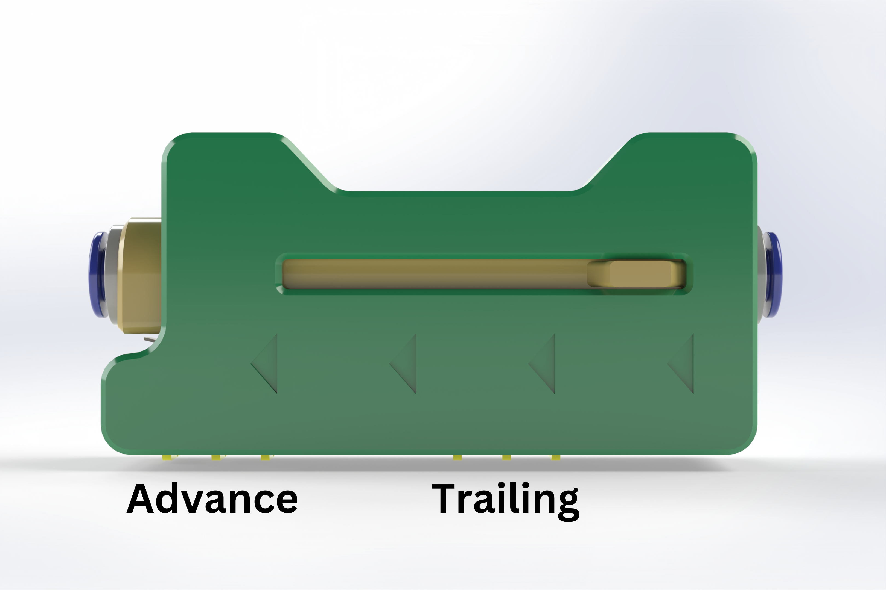
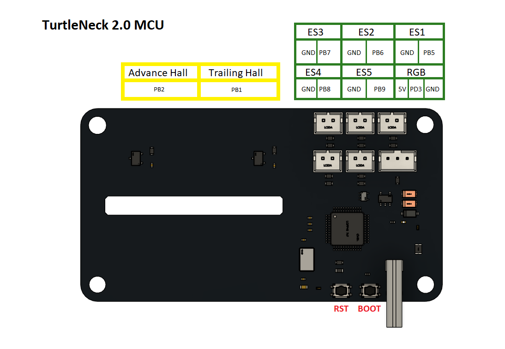

# Armored Turtle Automated Filament Control (AFC) Buffer

This file describes the `AFC_buffer` module, part of the Armored Turtle Automated Filament Control (AFC) project.

## Overview

The `AFC_buffer` module is responsible for handling two types of buffers: [TurtleNeck](https://github.com/ArmoredTurtle/TurtleNeck) 
and [TurtleNeck 2.0](https://github.com/ArmoredTurtle/TurtleNeck2.0). The Turtleneck buffer involves two sensors 
(advance and trailing), to help control filament movement.

The buffer adjusts rotation distance for active Box Turtle extruder(lane) based on sensor inputs and can either compress 
or expand to manage filament feeding properly. Each buffer type has unique configuration options and behaviors.

### Basic Functionality

The AFC buffer is designed to work with two extruder filament control systems. The primary extruder is at the print 
head(s) and the second is in the AFC unit. While the 2 extruders are synced they will never be perfect. This is where 
a buffer comes in. The buffer is used to make up for any inconsistencies in the sync between the 2 stepper motors.

## TurtleNeck Style buffer

Two sensor TurtleNeck-style buffers are used to modulate the rotation distance of the secondary extruder. 
The buffer's expansion or compression increases or decreases the rotation distance. 

* If the `trailing` sensor is triggered, this means that the buffer is compressed, the AFC will decrease rotation 
distance in order to move the filament quicker to the primary extruder. 

* If the `advance` sensor is triggered, this means that the buffer is expanded, the AFC will increase rotation 
distance in order to slow the filament moving to the primary extruder.

### Turtleneck 1.0




### TurtleNeck 2.0

[__Flashing TurtleNeck 2.0__](https://github.com/ArmoredTurtle/TurtleNeck2.0/blob/main/Flashing/README.md)



## Belay Style buffer

~~With the current implementation of `AFC_buffer` support for Belay is limited. Belay will still help to keep even tension on the primary extruder but in a different way. First, the AFC rotation distance has to be greater than the rotation distance of the primary extruder. While printing, the AFC will be pushing slightly less filament than the primary extruder, this will cause the Belay to become compressed toward the switch. When the switch is reached the AFC will make a configured amount of material to expand the Belay. This will continue for the duration of the print.~~

Belay style buffer is no longer supported, please use Turtleneck as a buffer for AFC-Klipper-Add-On.

## Configuration

### Required AFC Configuration Options

In `AFC_Hardware.cfg`, `buffer` must be defined. 

Example under `AFC_extruder`:
```cfg
buffer: TN
```

### Required AFC Hardware Configuration Options

In your AFC hardware configuration file, ensure you include the following options:

### TurtleNeck Style buffer

- `advance_pin`: Pin for the advance sensor.
- `trailing_pin`: Pin for the trailing sensor.

Optional for more fine-tuning:

- `multiplier_high`: Factor to move more filament through the secondary extruder.
- `multiplier_low`: Factor to move less filament through the secondary extruder.

### TurtleNeck 2.0 LED Indicator Configuration

Add to `AFC_hardware.cfg` file:

```cfg
[AFC_led Buffer_Indicator]
pin: TN:PD3
chain_count: 1
color_order: GRBW
initial_RED: 0.0
initial_GREEN: 0.0
initial_BLUE: 0.0
initial_WHITE: 0.0
```

### Optional AFC.cfg LED settings

```cfg
led_buffer_advancing: 0,0,1,0
led_buffer_trailing: 0,1,0,0
led_buffer_disable: 0,0,0,0.25
```

### Example Configs

```cfg
[AFC_buffer TN]
advance_pin:     # set advance pin
trailing_pin:    # set trailing pin
multiplier_high: 1.05   # default 1.05, factor to feed more filament
multiplier_low:  0.95   # default 0.95, factor to feed less filament
velocity: 100

[AFC_buffer TN2]
advance_pin: !turtleneck:ADVANCE
trailing_pin: !turtleneck:TRAILING
multiplier_high: 1.05   # default 1.05, factor to feed more filament
multiplier_low:  0.95   # default 0.95, factor to feed less filament
led_index: Buffer_Indicator:1
velocity: 100

[AFC_buffer Belay]
pin: mcu:BUFFER
distance: 12
velocity: 1000
accel: 1000
```

## Off-Nominal Buffer Configurations
Buffers can also be set per Unit/Stepper. If multiple lanes use the same buffer for one Unit then the buffer can just 
be added to Unit config (`AFC_BoxTurtle`, `AFC_NightOwl`, etc.). If a buffer is inputted into the `AFC_Stepper` 
config then this will override whatever is set at the Unit level.

### Example

Setting buffer for a single unit
```cfg
[AFC_BoxTurtle Turtle_1]
buffer: TN
```
Overriding buffer at stepper:
```cfg
[AFC_Stepper lane1]
unit: Turtle_1:1
buffer: TN2
<rest of config>
```

## AFC buffer commands

### QUERY BUFFER

The `QUERY_BUFFER` command reports the current state of the buffer and, if applicable, the rotation distance 
of the AFC stepper motor. 

Example usage:
`QUERY_BUFFER BUFFER=Turtleneck`

Example outputs:

- `Turtleneck: Trailing` - buffer is moving from the Advance trigger to the Trailing.
- `Turtleneck: Advancing` - buffer is moving from the Trailing trigger to the Advance. 

### SET_ROTATION_FACTOR
_For TurtleNeck Style Buffers_

This command allows the adjustment of rotation distance of the current AFC stepper motor by applying a factor. Factors 
greater than 1 will increase the rate filament is fed to the primary extruder, factors less than 1 but greater than 0 
will decrease the rate filament to the primary extruder.

Example Usage:
`SET_ROTATION_FACTOR BUFFER=TN FACTOR=1.1`

### SET_BUFFER_MULTIPLIER
_For TurtleNeck Style Buffers_

`SET_BUFFER_MULTIPLIER` used to live adjust the high and low multipliers for the buffer
- To change `multiplier_high`: `SET_BUFFER_MULTIPLIER BUFFER=TN MULTIPLIER=HIGH FACTOR=1.2`
- To change `multiplier_low`: `SET_BUFFER_MULTIPLIER BUFFER=TN MULTIPLIER=HIGH FACTOR=0.8`
    
!!! note
    Buffer config section must be updated for values to be saved
