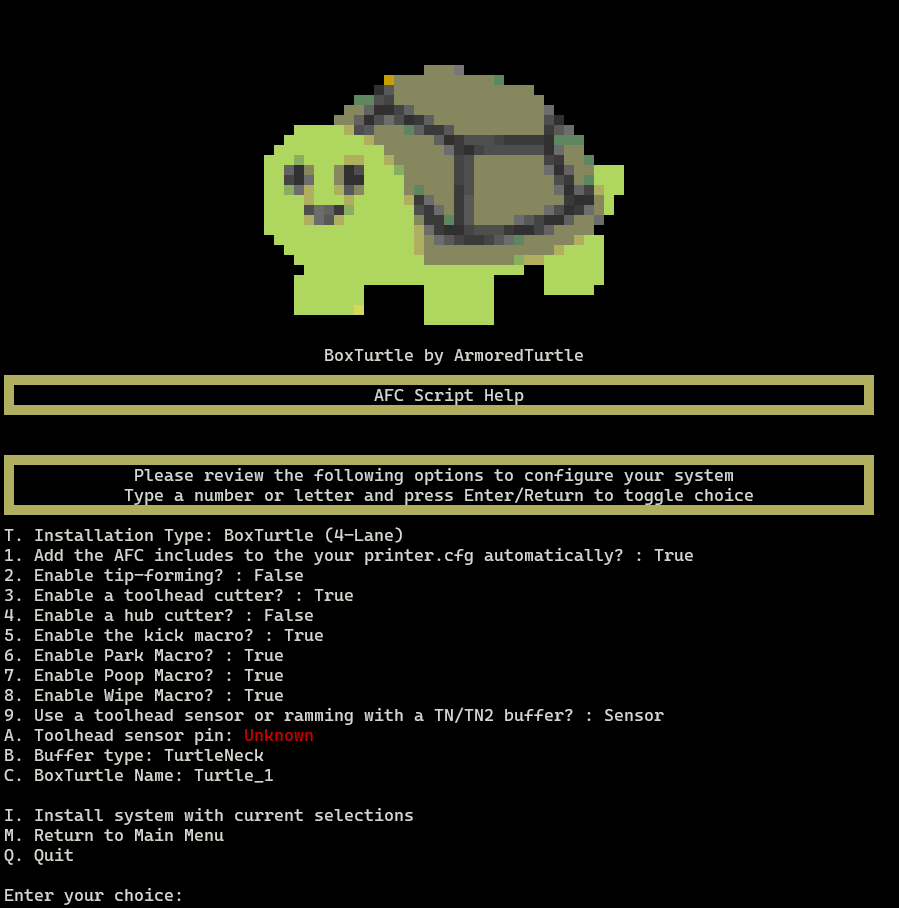

### Menu Overview

{ loading=lazy }

The `Installation` menu is used for the initial configuration of your system and will walk you through a guided menu
in order to help you configure your system properly. As with previous menus, this menu is designed in two sections.

The `top` section of the manual has a section labeled as `AFC Script Help`. This is a dynamic section that will provide 
feedback during the process on various options that you choose. 

{ loading=lazy }

Messages will appear in this section to help guide you through the process and provide visual feedback on the options you 
have selected.

### Menu Options

??? tip 

    As with other menus, the options available in the `Installation` menu are dynamic and will change based on the
    state of your system and the other options you choose.

#### `T. Installation Type`

This option will allow you to select the type of installation you wish to perform. The currently available options 
available are:

- BoxTurtle (4-Lane)
- NightOwl

#### `1. Printer.cfg Configuration`

This boolean is used to automatically include the necessary `[include AFC/*.cfg]` to your printer.cfg file. This 
defaults to *true* and is recommended to be left as such.

#### `2. Tip-forming`

=== "Description"
    This boolean is used to enable or disable the tip-forming functions. This defaults to *false* as the recommended 
    setup is to use a toolhead cutter and tip-forming may be unnecessary. If tip-forming is enabled, ensure that the 
    options in the `~/printer_data/config/AFC/AFC.cfg` file are set correctly.
=== "Configuration"
    Once set, this option can be changed via editing the `AFC.cfg` file typically located in the 
    `~/printer_data/config/AFC` directory.

#### `3. Enable a toolhead cutter`

=== "Description"
    This boolean is used to enable or disable the toolhead cutter. This defaults to *true* as the recommended setup 
    is to use a toolhead cutter. If the toolhead cutter is enabled, ensure that the options in the 
    `~/printer_data/config/AFC/AFC.cfg` file are set correctly.
=== "Configuration"
    Once set, this option can be changed via editing the `AFC.cfg` file typically located in the 
    `~/printer_data/config/AFC` directory.

#### `4. Enable a hub cutter`

=== "Description"
    This boolean is used to enable or disable the hub cutter. Hub cutters are a remote filament cutter not 
    co-located with the toolhead. Examples of this include user mods such as `Snappy` and other EREC based mods. This 
    defaults to *false* as the recommended setup is to use a toolhead cutter. If the hub cutter is enabled, ensure that 
    the options in the `~/printer_data/config/AFC/AFC.cfg` file are set correctly.
=== "Configuration"
    Once set, this option can be changed via editing the `AFC.cfg` file typically located in the 
    `~/printer_data/config/AFC` directory.

#### `5. Kick Macro`

=== "Description"
    This boolean is used to enable or disable the kick macro. This defaults to *true*. If the kick macro is enabled, 
    ensure that the options in the `~/printer_data/config/AFC/AFC_macro_vars.cfg` file are set correctly.
=== "Configuration"
    Once set, this option can be changed via editing the `AFC.cfg` file typically located in the 
    `~/printer_data/config/AFC` directory. Variables for this macro are located in the `AFC_macro_vars.cfg` file.

#### `6. Park Macro`

=== "Description"
    This boolean is used to enable or disable the park macro. This defaults to *true*. If the park macro is enabled, 
    ensure that the options in the `~/printer_data/config/AFC/AFC_macro_vars.cfg` file are set correctly.
=== "Configuration"
    Once set, this option can be changed via editing the `AFC.cfg` file typically located in the 
    `~/printer_data/config/AFC` directory. Variables for this macro are located in the `AFC_macro_vars.cfg` file.

#### `7. Poop Macro`

=== "Description"
    This boolean is used to enable or disable the poop macro. This defaults to *true*. If the poop macro is enabled, 
    ensure that the options in the `~/printer_data/config/AFC/AFC_macro_vars.cfg` file are set correctly.
=== "Configuration"
    Once set, this option can be changed via editing the `AFC.cfg` file typically located in the 
    `~/printer_data/config/AFC` directory. Variables for this macro are located in the `AFC_macro_vars.cfg` file.

#### `8. Wipe Macro`

=== "Description"
    This boolean is used to enable or disable the wipe macro. This defaults to *true*. If the wipe macro is enabled, 
    ensure that the options in the `~/printer_data/config/AFC/AFC_macro_vars.cfg` file are set correctly.
=== "Configuration"
    Once set, this option can be changed via editing the `AFC.cfg` file typically located in the 
    `~/printer_data/config/AFC` directory. Variables for this macro are located in the `AFC_macro_vars.cfg` file.

#### `9. Toolhead sensor or Ramming`

=== "Description"
    This boolean is used to select the usage of a toolhead filament sensor, or ramming with a filament buffer such as
    `Turtleneck` or `Turtleneck Pro`. 

#### `A. Toolhead Sensor Pin`

=== "Description"
    This option is used to select the pin that the toolhead sensor is connected to. This should be input in the 
    format of `mcu:pin` such as `nhk:gpio13` or `ebb:pa4`. Ensure that you use the proper pin for your specific 
    system. A pull-up `^` may be required in front of the pin if you experience intermittent issues with the sensor.

???+ note
    This option will only appear if the `Toolhead sensor or Ramming` option is set to `Sensor`.

#### `B. Buffer Type` 

=== "Description"
    This option is used to select the buffer type that you are using. The currently available options are:
    
    - Turtleneck
    - TurtleneckV2 (Pro)
    - None

???+ warning
    The use of a filament buffer is *HIGHLY* recommended. If you are not using a buffer, select `None`.

#### `I. Install system`

Once you select `I. Install system with current selections`, depending on the options you have selected, you may be 
prompted for more information.

Examples of this would be based on your choice of a Buffer. If you have selected a buffer, you will be prompted for
the `advance` and `trailing` pins. The defaults presented for these options correspond to the recommended settings 
per the wiring diagrams for the BoxTurtle system. 

???+ warning

    If you are using a different system, ensure that you have the proper wiring diagrams for your system and adjust 
    these settings accordingly.

    If you are connected to a AFC-Lite board, ensure you use a pull-up `^` in front of the pin for the buffer.

#### `M. Return to Main Menu`

Select this option to return to the main menu.

#### `Q. Quit`

Select this option to exit the AFC script.

## Post installation

Once you have completed the installation, you will notice some information in the `AFC Script Help` section. This 
information will be based on the options you have selected, but information similar to the below will be present:
```plaintext
- AFC Configuration updated with selected options at /home/pi/printer_data/config/AFC/AFC.cfg

- AFC-Klipper-Add-On python extensions installed to /home/pi/klipper/klippy/extras/

- Ensure you enter either your CAN bus or serial information in the /home/pi/printer_data/config/AFC/AFC_Turtle_1.cfg file

You may now quit the script or return to the main menu.
```

???+ warning

    Prior to restarting Klipper, ensure you check the files indicated above and modify them as necessary.

    Mandatory configuration changes are located [here](https://github.com/ArmoredTurtle/AFC-Klipper-Add-On/blob/main/README.md#mandatory-configuration-changes-all)
    and must be changed / checked. You *WILL* experience Klipper warnings if you do not modify these settings. 
