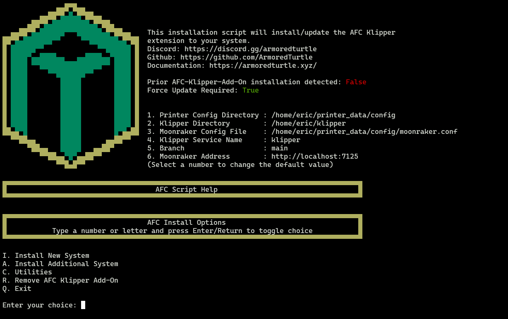
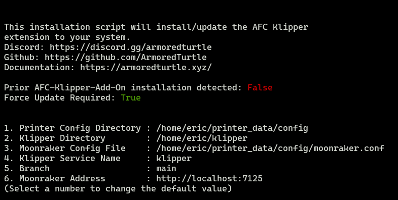
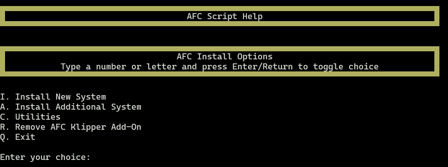

### Menu System

Each of our menus is designed to be user-friendly and easy to navigate. The menus are designed to be used with a keyboard,
and each option is preceded by an alphanumeric character. Simply type the character of the option you wish to select and 
you will either be prompted for input, or the option will cycle the various options.

### Menu Overview
When initially running the `install-afc.sh` script, you will be presented with the main menu. This menu will allow 
you to select the action you wish to perform.

{ loading=lazy }

This menu is broken up into two main sections. The `top` section contains information about your system that was
gathered during the installation process, or set by the user using a runtime options. 

{ loading=lazy }

Two options here are especially important to note for most users:

=== "Prior AFC-Klipper-Add-On installation detected"
    This boolean value will be set to `true` if the script detects that the AFC-Klipper-Add-On software has been
    detected being previously installed on your system. This is checking for the existing of a symbolic link in your
    Klipper extras directory to the AFC-Klipper-Add-On software. 

=== "Force Update Required"
    This boolean value will show as "True" if a prior installation has not been detected. Otherwise, this value will typically
    be set to `false`. This value is used if significant changes to the software have been made that require a full re-installation 
    of the software. This might be required when a new *major* version of the software has been released. This configuration value is 
    stored with the Moonraker database and the value can be retrieved via the Moonraker API. 

    To retrieve this value, you can use the following command: 

    ```bash
    curl -XGET localhost:7125/server/database/item?namespace=afc-install&key=version
    ```

    !!! warning
        This command is provided for transparency only. It is not recommended to modify this value manually.

{ loading=lazy }

The `bottom` section of the main menu is dynamic, that is, the options provided will change based on the state of your system.

### Menu Options
The options available in the bottom section are as follows:

#### `I. Install AFC-Klipper-Add-On`

This option will start the installation process for the AFC-Klipper-Add-On software. This option will walk you through a 
series of prompts to help you configure the software on your system.

!!! note
    This option will only appear if a prior installation of the AFC-Klipper-Add-On software has not been detected.

#### `A. Install Additional System`

This option will help you install additional physical units into your system. An example of this would be a second
BoxTurtle unit to go from a total of 4 lanes to 8 lanes. Another example would be adding a NightOwl to a system with a previous
BoxTurtle or any combination thereof with supported system.

!!! note
    This option is a `best-effort` option and will require knowledge of your system. You can expect to have to manually 
    configure the software after running this option.

#### `U. Update AFC-Klipper-Add-On`

This option will update the AFC-Klipper-Add-On software on your system. This option will clone the existing configured software 
repository, and ensure that all python extensions are properly linked. Depending on the state of your system, this option may
need to be run twice. 

!!! note
    This option will only appear if a previous installation of the AFC-Klipper-Add-On software has been detected.

#### `C. Utilities`

This option will provide you with various utilities to help manage your system. For example, if you want to rename 
an existing unit from `Turtle_1` (the default) to `Totally_Awesome_Turtle`, you can do so with this menu option.

#### `R. Remove AFC-Klipper-Add-On`

This option will remove the AFC-Klipper-Add-On software from your system. A backup of the software will be created in your 
`~/printer_data/config` (default) directory of your complete AFC system configuration prior to removal. The backup directory will 
be named in the format of `AFC.backup.<timestamp>`.

#### `Q. Quit`

This option will exit the script.
