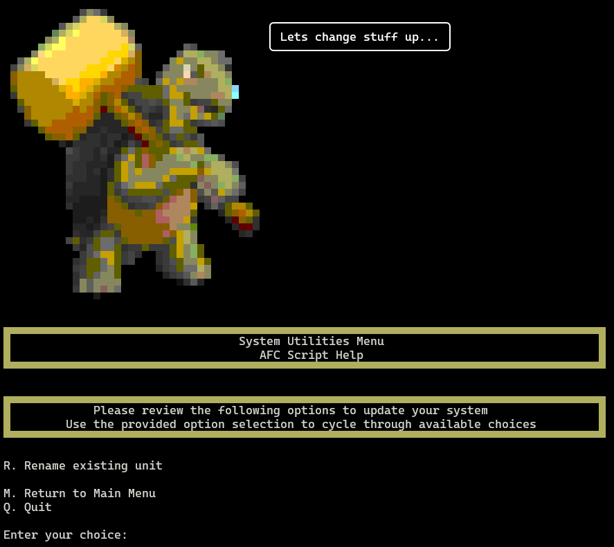

### Utilities Menu Overview

{ loading=lazy }

The `Utilities` menu is to change certain aspects of your system. It currently has one function available to use.

### Menu Options

#### `R. Rename existing unit`

This option will allow you to rename an existing unit. For example, by default, when you install a BoxTurtle system,
it is named `Turtle_1`. This value is displayed in the Mainsail/Fluidd GUI along with multiple places in the 
configuration files.

This option will prompt you for the following information:

{ loading=lazy }

    - Name of the unit you want to rename
    - New name of the unit

A validation check will be performed to ensure that the name meets specific requirements

??? note "Name Validation Requirements"

        Specifically, the name must meet the following regex:
        
        `^[a-zA-Z0-9_]+$`. It also must be less than 24 chars in length.

Once the name is validated, the system will rename the unit and update the configuration files accordingly. 

#### `M. Return to Main Menu`

Select this option to return to the main menu.

#### `Q. Quit`

Select this option to exit the AFC script.